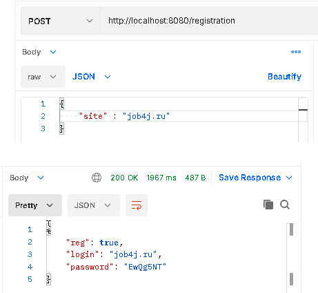
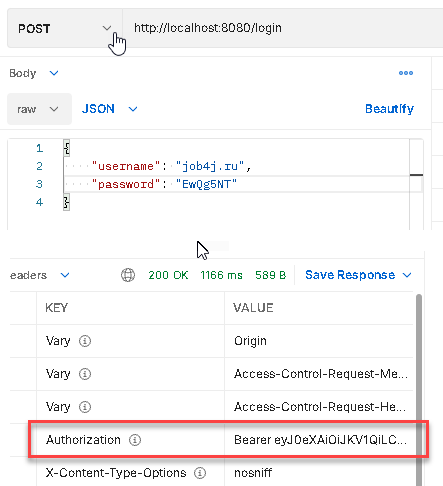
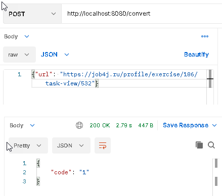
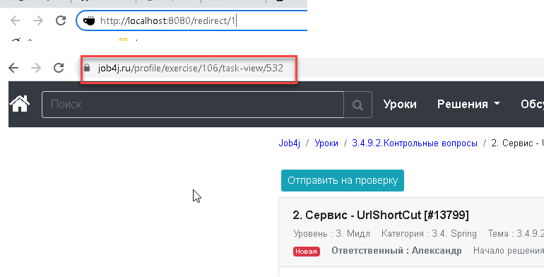
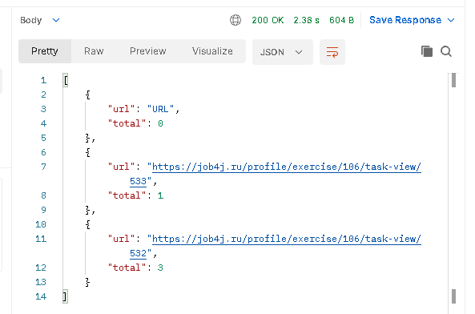

# job4j_url_shortcut

## О проекте

В этом проекте будет разработан сервис замены ссылок.

Описание сервиса: для обеспечения безопасности пользователей, все ссылки на сайте заменяются ссылками на наш сервис.
В начале регистрируется сайт в систему. Затем может регистрировать ссылки в системе и получать ключи (преобразованные ссылки).
Когда клиент переходит по преобразованной ссылке система должна вернуть ассоциированный адрес и статус 302.

Технологии проекта: Spring boot, Spring data, Spring security, JWT.
Сборка проекта производится командой "mvn package".
Запуск проекта производится командой "java -jar job4j_url_shortcut-0.0.1-SNAPSHOT.jar"

API:

POST /registration - регистрация сайта.
POST /login - авторизация.
POST /convert - получение ключа ссылки.
GET /redirect/{code} - переадресация на ассоциированный адрес.
GET /statistic - статситика по вызовам каждой ссылки.

1. Регистрация сайта.
   Сервисом могут пользоваться разные сайты. Каждому сайту выдается пару пароль и логин.
   Флаг reg указывает, что регистрация выполнена или нет, то есть сайт уже есть в системе.

2. Авторизация.
   Пользователь отправляет POST запрос с login и password и получает токен.
   Этот токен отправляет в запросе в блоке HEAD.

3. Регистрация URL.
   Поле того, как пользователь авторизовался он может отправлять на сайт ссылки и получать преобразованные ссылки.

   
4. Переадресация.
   Когда сайт отправляет ссылку с кодом в ответ нужно вернуть ассоциированный адрес и статус 302.

5. Статистика.
   В сервисе считается количество вызовов каждого адреса.

